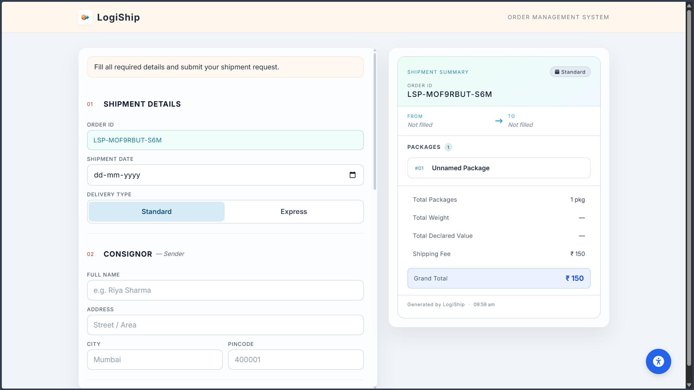

# LogiShip - Logistics Order Management System

LogiShip is a premium, high-performance logistics shipment management application built with **Next.js 15+** and **React 19**. It provides a seamless, real-time interface for creating, managing, and previewing shipment orders with professional-grade UI/UX.



## 🚀 Features

### 1. Real-time Live Preview
*   **Instant Feedback**: See your shipment slip update instantly as you type.
*   **Professional Layout**: A beautifully formatted preview that mimics actual logistics paperwork.

### 2. Smart Form Management
*   **Dynamic Package List**: Add multiple packages with individual weight and dimension tracking.
*   **Validation**: Robust input validation to ensure data integrity before submission.
*   **State Persistence**: Reliable state management using React hooks to ensure synchronization between the form and preview panels.

### 3. Automated Calculations
*   **Shipping Costs**: Dynamic calculation based on package weight and shipping method.
*   **Insurance & Fees**: Automatic insurance calculation and tax processing.
*   **Grand Totals**: Accurate, real-time financial summaries.

### 4. Accessibility First (a11y)
*   **ARIA Compliant**: Fully accessible form elements and navigation.
*   **Accessibility Widget**: Built-in controls for font-scaling and high-contrast modes.
*   **Semantic HTML**: Proper structure for screen readers.

### 5. Responsive & Premium UI
*   **Adaptive Layout**: Two-column layout for desktop that intelligently stacks for mobile devices.
*   **Modern Aesthetics**: Dark mode support, smooth transitions, and high-quality typography.
*   **Print Optimization**: Formatted specifically for printing shipment slips.

---

## 🛠️ Tech Stack

- **Framework**: [Next.js 15 (App Router)](https://nextjs.org/)
- **Library**: [React 19](https://react.dev/)
- **Styling**: Vanilla CSS Modules (for scoped, high-performance styling)
- **Icons**: Custom SVG icons and Lucide React
- **Deployment**: Optimized for Vercel

---

## 📁 Project Structure

```text
LogiShip/
├── app/                # Next.js App Router (Pages & Layouts)
├── components/         # Reusable UI & Feature Components
│   ├── OrderForm/      # Main shipment data entry
│   ├── ShipmentPreview/# Live updating slip preview
│   ├── Accessibility/  # A11y providers and widgets
│   └── ui/             # Core design system components
├── public/             # Static assets and images
└── styles/             # Global design tokens and CSS modules
```

---

## 🚦 Getting Started

### Prerequisites
- Node.js 18.x or higher
- npm, yarn, or pnpm

### Installation

1. **Clone the repository**
   ```bash
   git clone https://github.com/albin-shaji/LogiShip.git
   cd LogiShip
   ```

2. **Install dependencies**
   ```bash
   npm install
   ```

3. **Run the development server**
   ```bash
   npm run dev
   ```

4. **Build for production**
   ```bash
   npm run build
   ```

---

## 📝 Workflow

1. **Information Entry**: Enter Sender and Receiver details with full address validation.
2. **Package Configuration**: Add items, specify dimensions, and select weight units.
3. **Service Selection**: Choose between Express, Standard, or Economy shipping methods.
4. **Instant Review**: Review the generated shipment ID and cost breakdown in the live preview panel.
5. **Finalization**: Generate the printable slip for the logistics workflow.

---

## 👤 Author

**Albin Shaji**
- 🌐 Website: [albinshaji.com](https://albinshaji.com)
- 📧 Email: [albinshaji39k@gmail.com](mailto:albinshaji39k@gmail.com)
- 🐙 GitHub: [@albin-shaji](https://github.com/albin-shaji)

---

*Developed with ❤️ by Albin Shaji.*
